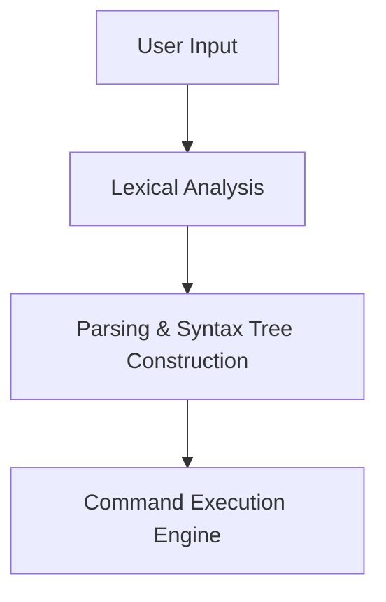

## LICENSE

- This project is licensed under the [**`Mozilla Public License 2.0`**](LICENSE).
- **You are under obligation** to comply with this license while interacting with this code, in any way, shape or form. 
- As the creators of this project, we hereby declare that we grant authorization to all 42 Campus Administrators worldwide, to take any action they deem necessary; in any occurance of plagiarism, blind copying and/or cheating. 
- We also hereby declare that we reserve all our rights to take legal action in any detectance of non-compliance to the license. 

## Who built this project?

- **Kuzey Berk YILMAZ** – [GitHub Profile](https://github.com/gm-infinite) – [Intra 42 Profile](https://profile.intra.42.fr/users/kuzyilma)
- **Emir İsmail GENÇ** – [GitHub Profile](https://github.com/thecloudrazor) – [Intra 42 Profile](https://profile.intra.42.fr/users/emgenc)

Please always feel free to reach out for any kind of collaboration.

## Table of Contents

1. [Introduction](#minishell)
2. [Architecture Overview](#architecture-overview)
3. [Features](#features)
4. [Testing & Validation](#test-cases)

## minishell

The existence of shells is linked to the very existence of IT. 

Initially, developers used `aligned 1/0 switches` to communicate with computers, which was quite cumbersome. The invention of shells allowed interactive command-line communication in a language closer to human language. With `minishell`, we revisit the fundamental problems faced before modern GUIs and sophisticated shells like `bash`.

The **`minishell`** project is about creating a simple shell, but it’s also a deep-dive into how shells work under the hood. 

By re-implementing main functionalities of the **`bash`** shell, we gain understanding of `syscalls`, `process creation`, `FD management`, `I/O redirections` and `command parsing` in a Unix environment.

From the projects **`pipex`** and **`minitalk`**, we already learned about `IPC (Inter-Process Communication via pipes)` and `robust signal handling with user interactions`. 

Both of us combine our know-how and skills to build this project and ensure that it complies with both `mandatory` and **`bonus`** requirements.

## Architecture Overview

*Figure: High-level architecture of **`minishell`**.*

## Features

Our shell currently supports:

- ~~**Basic Command Execution**~~
- ~~**Pipes (`|`)**~~
- ~~**Redirections**~~
  - ~~**Output:** Overwrite (`>`) and append (`>>`)~~
  - ~~**Input:** (`<`)~~
  - ~~**Error Redirection:** (`2>`, `&>`)~~
- ~~**Built-In Commands** such as `cd`, `echo`, `pwd`, `export`, `unset`, `env`, and `exit`~~
- ~~**Environment Variable Handling**s~~
- ~~**Signal Handling:** SIGINT and SIGQUIT handling~~

## Test Cases (to be expanded and extended)

| **Test Case**             | **Expected Outcome**            |
|---------------------------|---------------------------------|
| `echo "Hello World"`      | Displays "Hello World"          |
| `ls \| grep minishell`     | Filters output of `ls`          |
| `cat < input.txt > output.txt` | File `output.txt` contains contents of `input.txt` |
| `cd / && pwd`             | Displays `/`                    |
