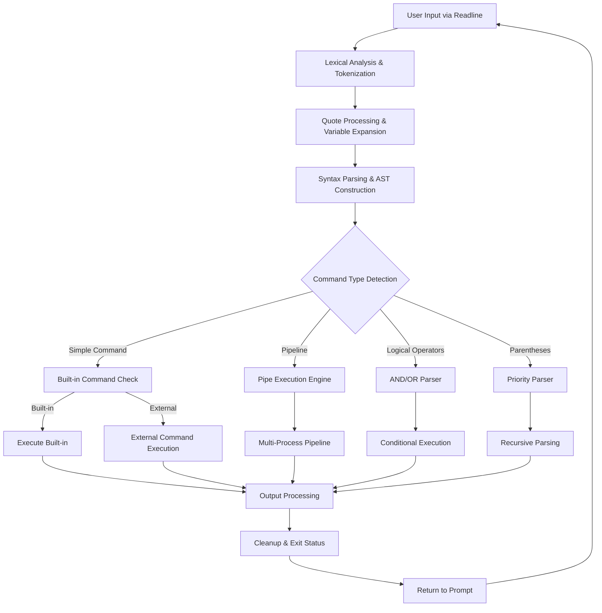

# Minishell - A Comprehensive Bash-like Shell Implementation

## LICENSE

- This project is licensed under the [**`Mozilla Public License 2.0`**](LICENSE).
- **You are under obligation** to comply with this license while interacting with this code, in any way, shape or form. 
- As the creators of this project, we hereby declare that we grant authorization to all 42 Campus Administrators worldwide, to take any action they deem necessary; in any occurance of plagiarism, blind copying and/or cheating. 
- We also hereby declare that we reserve all our rights to take legal action in any detectance of non-compliance to the license. 

## Who's involved in this project?

- **Kuzey Berk YILMAZ** – [GitHub Profile](https://github.com/gm-infinite) – [Intra 42 Profile](https://profile.intra.42.fr/users/kuzyilma)
- **Emir İsmail GENÇ** – [GitHub Profile](https://github.com/thecloudrazor) – [Intra 42 Profile](https://profile.intra.42.fr/users/emgenc)

Please always feel free to reach out for any kind of collaboration.

---

## Table of Contents

1. [Introduction](#introduction)
2. [Architecture Overview](#architecture-overview)
3. [Core Components](#core-components)
4. [Features](#features)
5. [Implementation Details](#implementation-details)
6. [Memory Management](#memory-management)
7. [Testing & Validation](#testing--validation)
8. [Build Instructions](#build-instructions)
9. [Usage Examples](#usage-examples)

---

## Introduction

The existence of shells is fundamentally linked to the evolution of computing interfaces. Initially, developers used `aligned 1/0 switches` to communicate with computers, which was both cumbersome and error-prone. The invention of command-line shells revolutionized this interaction by allowing developers to communicate with computers using a language closer to natural human language.

**Minishell** represents a comprehensive reimplementation of core bash functionality, serving as both a functional shell and an educational deep-dive into the intricate workings of Unix/Linux command interpreters. This project explores fundamental concepts including:

- **System Calls**: Direct interaction with the operating system kernel
- **Process Management**: Creation, execution, and lifecycle management of child processes  
- **File Descriptor Management**: Low-level I/O operations and redirection handling
- **Inter-Process Communication**: Pipe-based communication between commands
- **Signal Handling**: Robust management of asynchronous events and interrupts
- **Memory Management**: Zero-leak memory allocation and deallocation strategies
- **Lexical Analysis**: Tokenization and parsing of complex command structures

Building upon knowledge from previous projects like **`pipex`** (Inter-Process Communication via pipes) and **`minitalk`** (signal handling), this implementation demonstrates advanced Unix programming concepts while maintaining strict compliance with both mandatory and bonus requirements.

---

## Architecture Overview



*Figure: Comprehensive architecture diagram showing the complete command processing pipeline from user input to execution and cleanup.*

---

## Core Components

### 1. **Main Shell Loop** (`main/main.c`)
The central control structure that:
- Initializes the shell environment and signal handlers
- Manages the interactive readline loop
- Handles graceful shutdown and cleanup
- Maintains shell state across command executions

### 2. **Tokenizer & Parser** (`t_split_utils/`)
Advanced tokenization system featuring:
- Quote-aware splitting that respects single and double quotes
- Operator recognition (pipes, redirections, logical operators)
- Variable expansion with quote context preservation
- Robust error handling for malformed input

### 3. **Command Execution Engine** (`main/executor.c`)
Multi-tiered execution system supporting:
- Built-in command dispatch with proper I/O redirection
- External command resolution via PATH lookup
- Complex pipeline execution with proper file descriptor management
- Error propagation and exit status handling

### 4. **Pipeline Manager** (`main/pipes.c`)
Sophisticated pipeline implementation featuring:
- Dynamic pipe creation and management
- Process synchronization and cleanup
- Proper file descriptor inheritance and closing
- Robust error handling for pipeline failures

### 5. **Redirection Handler** (`main/redirections.c`)
Comprehensive I/O redirection supporting:
- Standard input/output redirection (`<`, `>`, `>>`)
- Error stream redirection (`2>`)
- Here documents (`<<`) with proper delimiter handling
- Complex redirection combinations in pipelines

### 6. **Logical Operator Parser** (`and_or_parser/`)
Advanced parsing engine for:
- AND (`&&`) and OR (`||`) logical operators
- Parentheses-based priority grouping
- Nested expression evaluation
- Short-circuit evaluation semantics

### 7. **Environment Manager** (`main/environment.c`)
Dynamic environment handling including:
- Variable expansion with proper quote semantics
- Export/unset operations with validation
- Environment inheritance for child processes
- Memory-safe variable storage and retrieval

### 8. **Signal Handler** (`main/signals.c`)
Robust signal management featuring:
- Interactive vs non-interactive signal behavior
- Proper signal masking during critical sections
- Child process signal isolation
- Graceful interruption handling

---

## Features

### ✅ **Core Shell Functionality**
- **Interactive Prompt**: Full readline integration with history support
- **Command Execution**: Both built-in and external command support
- **Exit Status Management**: Proper propagation and storage of exit codes
- **Working Directory Management**: Robust `cd` implementation with error handling

### ✅ **Built-in Commands**
- **`echo`**: With `-n` flag support and proper argument handling
- **`cd`**: Relative and absolute path navigation with error reporting
- **`pwd`**: Current working directory display
- **`export`**: Environment variable creation and modification
- **`unset`**: Environment variable removal with validation
- **`env`**: Environment listing with proper formatting
- **`exit`**: Graceful shell termination with optional exit codes

### ✅ **I/O Redirection System**
- **Input Redirection** (`<`): File-to-stdin redirection with error handling
- **Output Redirection** (`>`): Stdout-to-file with truncation
- **Append Redirection** (`>>`): Stdout-to-file with append mode
- **Error Redirection** (`2>`): Stderr-to-file redirection
- **Here Documents** (`<<`): Multi-line input with custom delimiters

### ✅ **Pipeline Support**
- **Command Chaining**: Multiple commands connected via pipes
- **Proper FD Management**: Automatic file descriptor cleanup
- **Process Synchronization**: Coordinated execution and waiting
- **Error Propagation**: Proper exit status from pipeline components

### ✅ **Advanced Parsing Features**
- **Quote Handling**: Single (`'`) and double (`"`) quote processing
- **Variable Expansion**: Environment variable substitution with quote awareness
- **Logical Operators**: AND (`&&`) and OR (`||`) with short-circuit evaluation
- **Parentheses Grouping**: Priority control and nested expressions
- **Operator Precedence**: Proper evaluation order for complex expressions

### ✅ **Signal Management**
- **SIGINT Handling**: Ctrl+C interrupt processing
- **SIGQUIT Handling**: Ctrl+\ quit signal management  
- **Interactive Signals**: Different behavior for interactive vs script mode
- **Child Process Isolation**: Proper signal masking for subprocesses

### ✅ **Memory Management**
- **Zero Memory Leaks**: Comprehensive cleanup verified by Valgrind
- **Dynamic Allocation**: Efficient memory usage with proper error handling
- **Resource Cleanup**: Automatic cleanup on error conditions and exit
- **Signal-Safe Operations**: Memory operations safe during signal handling

---

## Implementation Details

### **Tokenization Algorithm**
The tokenization process implements a sophisticated finite state machine that:

1. **Character Classification**: Identifies special characters (quotes, operators, whitespace)
2. **State Management**: Tracks current parsing context (quoted, unquoted, operator)
3. **Token Boundary Detection**: Properly separates tokens while respecting quotes
4. **Quote Pair Matching**: Ensures proper quote closure and nesting
5. **Operator Recognition**: Identifies compound operators (`>>`, `<<`, `&&`, `||`)

### **Variable Expansion Engine**
The variable expansion system features:

1. **Context-Aware Expansion**: Different behavior inside single vs double quotes
2. **Recursive Resolution**: Handles nested variable references
3. **Error Handling**: Graceful handling of undefined variables
4. **Quote Preservation**: Maintains quote semantics during expansion
5. **Special Variables**: Support for `$?` (exit status) and other special vars

### **Pipeline Execution Model**
Pipeline execution follows a sophisticated multi-process model:

1. **Pipe Creation**: Dynamic allocation of pipe pairs for command chain
2. **Process Forking**: Strategic forking to create isolated command environments  
3. **FD Redirection**: Systematic redirection of stdin/stdout through pipes
4. **Synchronization**: Coordinated process execution and cleanup
5. **Exit Status Propagation**: Proper exit code handling from pipeline tail

### **Memory Allocation Strategy**
The memory management system employs:

1. **RAII Principles**: Resource acquisition tied to initialization
2. **Error Path Cleanup**: Comprehensive cleanup on all error conditions
3. **Reference Counting**: Careful tracking of allocated resources
4. **Signal-Safe Allocation**: Memory operations safe during signal delivery
5. **Leak Detection**: Integration with Valgrind for comprehensive leak testing

---

## Memory Management

### **Zero-Leak Architecture**
This implementation achieves zero memory leaks through:

- **Systematic Cleanup**: Every allocation paired with corresponding deallocation
- **Error Path Management**: Cleanup on all possible error conditions
- **Exit Handler Registration**: Automatic cleanup on shell termination
- **Signal-Safe Operations**: Memory operations safe during asynchronous events

### **Allocation Tracking**
- **Environment Variables**: Dynamic allocation with proper cleanup
- **Command Arguments**: Temporary allocation with scope-based cleanup  
- **Parse Trees**: Recursive cleanup of complex data structures
- **I/O Buffers**: Automatic cleanup of file operation buffers

### **Valgrind Integration**
- **Comprehensive Testing**: Full leak detection across all code paths
- **Suppression Files**: System library leak suppression for clean reports
- **Stress Testing**: Memory validation under high-load conditions
- **Continuous Validation**: Regular testing throughout development cycle

---

## Testing & Validation

### **Comprehensive Test Suite**

| **Category** | **Test Description** | **Expected Behavior** |
|--------------|---------------------|----------------------|
| **Basic Commands** | `echo "Hello World"` | Displays "Hello World" |
| **Pipelines** | `ls \| grep minishell` | Filters `ls` output through `grep` |
| **Redirections** | `cat < input.txt > output.txt` | Copies file content via redirection |
| **Built-ins** | `cd / && pwd` | Changes directory and displays `/` |
| **Variables** | `export VAR=test && echo $VAR` | Sets and displays variable value |
| **Logical Ops** | `true && echo success \|\| echo fail` | Displays "success" due to short-circuit |
| **Parentheses** | `(echo first && echo second) \|\| echo third` | Groups commands with priority |
| **Complex** | `(ls /tmp > out.txt 2> err.txt) && echo done` | Complex redirection with grouping |
| **Here Docs** | `cat << EOF<newline>content<newline>EOF` | Multi-line input processing |
| **Error Handling** | `nonexistent_command` | Proper error message and exit code |

---

## Build Instructions

### **Prerequisites**
- Any GCC compiler with C99 support will do
- GNU Make
- Readline development library (This is needed for interactive input and history. You can do a quick google on installing it.)
- Optional: Valgrind for memory testing.

### **Compilation**
```bash
# Standard build
make

# Clean build artifacts  
make clean

# Complete rebuild
make re

### **Build Targets**
- **`all`**: Default target, builds the minishell executable
- **`clean`**: Removes object files and temporary artifacts
- **`fclean`**: Complete cleanup including executable
- **`re`**: Clean rebuild of entire project

---

## Usage Examples

### **Basic Command Execution**
```bash
# Simple commands
minishell> ls -la
minishell> echo "Hello, World!"
minishell> pwd

# Command with arguments
minishell> grep "pattern" file.txt
```

### **Pipeline Operations**
```bash
# Simple pipeline
minishell> ls | grep ".txt" | wc -l

# Complex pipeline with multiple stages
minishell> cat file.txt | grep "error" | sort | uniq -c | sort -nr
```

### **I/O Redirection**
```bash
# Output redirection
minishell> echo "content" > file.txt
minishell> ls >> output.log

# Input redirection  
minishell> grep "pattern" < input.txt

# Error redirection
minishell> ls /nonexistent 2> error.log

# Here document
minishell> cat << EOF
> Line 1
> Line 2  
> EOF
```

### **Logical Operators & Parentheses**
```bash
# Logical AND/OR
minishell> echo "start" && echo "success" || echo "failure"

# Parentheses grouping
minishell> (echo "first" && echo "second") || echo "fallback"

# Complex nested expressions
minishell> ((export VAR=test && echo $VAR) && echo "set") || echo "failed"
```

### **Environment Variables**
```bash
# Variable operations
minishell> export PATH="/usr/bin:/bin"
minishell> echo $PATH
minishell> unset PATH

# Variable expansion in commands
minishell> export FILE="test.txt"
minishell> cat $FILE
```

---

## Technical Specifications

### **Supported Platforms**
- Linux
- macOS (with Homebrew readline. otherwise it won't work...)
- Any other POSIX-compliant system

### **Dependencies**
- **POSIX Syscalls**: You'll need a standard Unix/Linux system interface to be able to run this shell.
- **Readline Library**: This is needed for interactive input and history. You can do a quick google on installing it.
- **GNU-Libc**: Standard C library functions

### **Compliance**
- **POSIX**: As of our knowledge, core compatibility with POSIX shell semantics is ensured. 
- **Bash**: Compatibility and similarity with common bash features are ensured, to the extent that the project's subject PDF tells it to us to implement that specific feature. 
- **42 Subject**: Full compliance with the project's both mandatory and bonus requirements
- **Memory Safety**: Zero memory leaks, zero still reachables, advanced error handling
